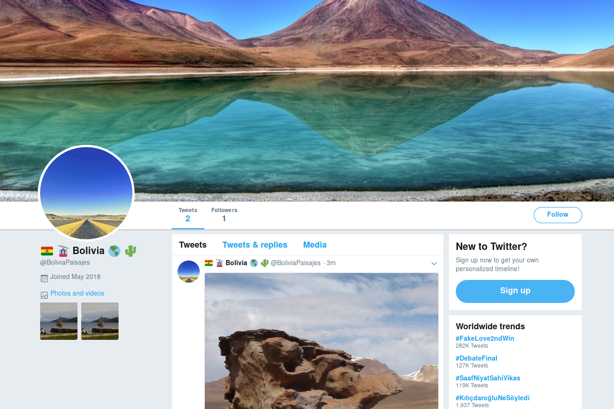

# Bot Twitter "Paisajes de Bolivia"

Ver el bot Twitter en https://twitter.com/BoliviaPaisajes

[](https://twitter.com/BoliviaPaisajes)

## Para instalar

Instalar las librerías

- [dateutil](http://labix.org/python-dateutil)
- [google-images-download](https://pypi.org/project/google-images-download/)
- [tweepy](https://pypi.org/project/tweepy/)

Copiar `secrets.py.example` a `secrets.py` y remplazar las claves y secretos (ver https://scotch.io/tutorials/build-a-tweet-bot-with-python).

## Para usar

Lanzar con

```bash
python bot.py
```
